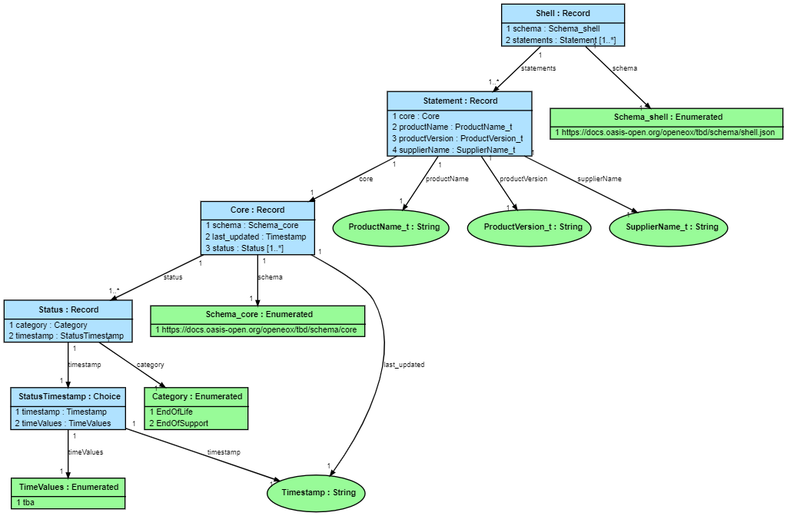

# EoX Information Model

An information model (IM) is a formal definition of structured data at a higher level of abstraction
than a concrete schema. It is intended to be easy to work with and understand, and to serve as the
*single source of truth* for documentation in multiple formats, concrete schemas in multiple formats,
message generation and validation in multiple data formats, and code generation for multiple
programming languages.

This is an information model for two proposed EoX schema files (core.json, shell.json) written in
the JSON Abstract Data Notation (JADN) language. It can be written as either JSON data
or as a textual Information Definition Language, and can be converted back and forth between those formats.
It can also be used to generate property tables in HTML or Markdown format and to ERDs in GraphVis or PlantUML format
for use in specification documents:

**Fig. 1**: shell.jidl
```
Shell = Record
   1 schema           Schema_shell
   2 statements       Statement [1..*]             // Contains a list of statement elements.

Schema_shell = Enumerated                          // Specifies the schema the JSON object must be valid against.
   1 https://docs.oasis-open.org/openeox/tbd/schema/shell.json

Statement = Record                                 // Statements contain the single OpenEoX entries.
   1 core             c:Core
   2 productName      ProductName_t
   3 productVersion   ProductVersion_t
   4 supplierName     SupplierName_t
```

**Fig. 2**: shell.jadn
```json
    ["Shell", "Record", [], "", [
      [1, "schema", "Schema_shell", [], ""],
      [2, "statements", "Statement", ["]0"], "Contains a list of statement elements."]
    ]],

    ["Schema_shell", "Enumerated", [], "Specifies the schema the JSON object must be valid against.", [
      [1, "https://docs.oasis-open.org/openeox/tbd/schema/shell.json", ""]
    ]],

    ["Statement", "Record", [], "Statements contain the single OpenEoX entries.", [
      [1, "core", "c:Core", [], ""],
      [2, "productName", "ProductName_t", [], ""],
      [3, "productVersion", "ProductVersion_t", [], ""],
      [4, "supplierName", "SupplierName_t", [], ""]
    ]],
```

**Fig. 3**: shell.md

**********
**Type: Shell (Record)**

| ID | Name           | Type         | \#    | Description                            |
|----|----------------|--------------|-------|----------------------------------------|
| 1  | **schema**     | Schema_shell | 1     |                                        |
| 2  | **statements** | Statement    | 1..\* | Contains a list of statement elements. |

**********

Specifies the schema the JSON object must be valid against.

**Type: Schema_shell (Enumerated)**

| ID | Item                                                          | Description |
|----|---------------------------------------------------------------|-------------|
| 1  | **https://docs.oasis-open.org/openeox/tbd/schema/shell.json** |             |

**********

Statements contain the single OpenEoX entries.

**Type: Statement (Record)**

| ID | Name               | Type             | \# | Description |
|----|--------------------|------------------|----|-------------|
| 1  | **core**           | c:Core           | 1  |             |
| 2  | **productName**    | ProductName_t    | 1  |             |
| 3  | **productVersion** | ProductVersion_t | 1  |             |
| 4  | **supplierName**   | SupplierName_t   | 1  |             |

**********

**Fig. 4**: EoX entity relationship diagram

